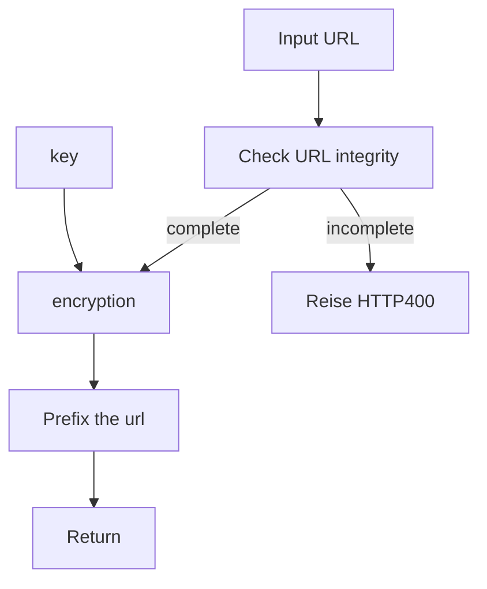
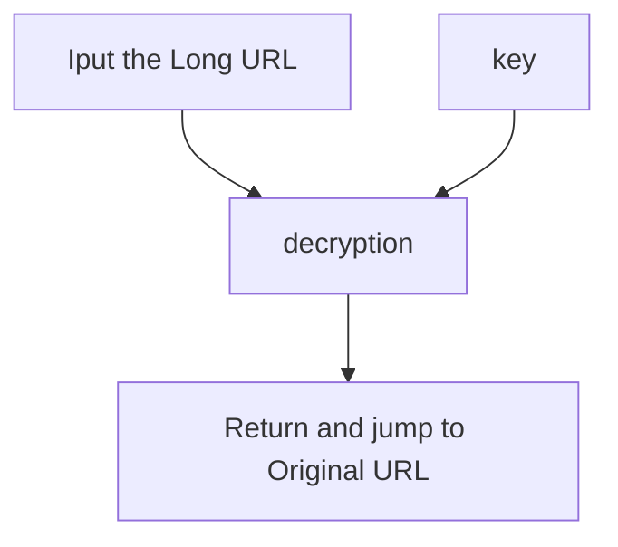

# LongURL

# MOVE to [jhihyulin/LURL](https://github.com/jhihyulin/LURL)

A simple Long URL service deploy on deta.sh with FastAPI

This is a simple long url service, you can use it to longten your short url.

URL too short? Try this.

## How it works

Create:



Inquire:



## Deploy

step 1: fork this repositorities

step 2: visit https://web.deta.sh and login

step 3: create a new project

step 4: visit https://web.deta.sh/settings and create a new Access Token

step 5: go to your repositorie's setting, add a new secret named ```DETA_PROJECT_NAME``` and set the value to the name you created in step 3

step 6: go to your repositorie's setting, add a new secret named ```DETA_TOKEN``` and set the value to the token you created in step 4

step 7: patch to ```micros/LongURL-main/.env``` and set ```KEY``` and ```SPLIT_TEXT``` the value you randomly generated

step 8: go to your repositorie's action page tick ```init mode``` then click ```Run workflow``` to init micro

step 9: From now on we can GitHub actiion renew ```.env``` file, so we have two ways to set the ```SERVER_PREFIX``` parameter, you can use your custom domain or use the deta provided domain, find the default domain on https://web.deta.sh micros>LongURL-main that visiable on the righttop of the page, about hoe to setup custom domain, you can find it on https://docs.deta.sh/docs/micros/custom_domains

1. go to your repositorie, path to ```micros/LongURL-main/main.py``` and edit the ```SERVER_PREFIX``` parameter inline 20, then go to your repositorie's action page tick ```deploy``` option and click ```Run workflow``` to redeploy
```python
#original
SERVER_PREFIX = os.getenv('SERVER_PREFIX')
#change to
SERVER_PREFIX = "<your server prefix>"
```

2. go to your repositorie, path to ```micros/LongURL-main/.env``` and edit the ```SERVER_PREFIX``` parameter, then go to your repositorie's action page tick ```update env``` option and click ```Run workflow``` to redeploy.


3. clone repositorities to your local, edit the ```SERVER_PREFIX``` parameter in ```micros/LongURL-main/.env``` and use deta cli to update
```env
SERVER_PREFIX=<your server prefix>
```


### Local develop
if you want develop on your local, you have some steps to do

step 1: install python3.9 or higher

step 2: install deta cli, you can find it on https://docs.deta.sh/docs/cli/install

step 3: clone repositorie to your local

step 4: ```cd micros/LongURL-main```

step 5: ```pip install -r requirements.txt```

step 6: ```deta login``` to login

step 7: add the ```KEY```, ```SPLIT_TEXT```, ```SERVER_PREFIX```, parameter to ```micros/LongURL-main/.env```

```env
KEY=<your key>
SPLIT_TEXT=<your split text>
SERVER_PREFIX=<your server prefix>
```

step 8: ```deta update -e .env``` to update env

step 9: ```deta deploy``` to deploy

### Visor
Record the content of the request and its success on https://web.deta.sh > micros > visor
step 1: go to your repositorie's action page tick ```visor enable``` and click ```Run workflow```

step 2: Finish, visor is enable

## Usage
```POST /create``` to create a long url
```json
{
    "origin_url": "<your short url>"
}
```

response```HTTP200```
```json
{
    "url": "<your long url>"
}
```

```GET /<long url>``` to redirect to the short url

response```HTTP307```
```python
RedirectResponse(original_url)
```

## Reference
[Deploy FastAPI on Deta](https://fastapi.tiangolo.com/deployment/deta/)

[Short URL API Server 架設心得與教學](https://hackmd.io/@Xpz2MX78SomsO4mV3ejdqg/SyvmmBCfX?type=view)

[BogDAAAMN/deta-deploy-action](https://github.com/BogDAAAMN/deta-deploy-action)

